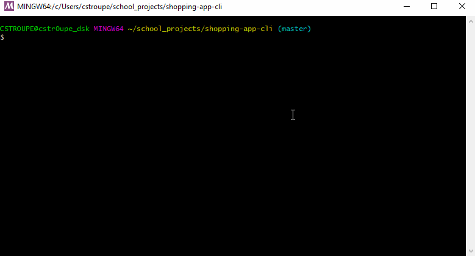

# Bamazon Shopping App

This application is a node js application that allows a user to browse the stock of a demo version of an online shopping site called "Bamazon". The user can list all the available products for sale, and then purchase an item based on the product id. The user can purchase multiple items from the same id, and if the stock of the item is lower then the requested purchase, the user will be notified that there is insufficent stock to fufill the request. If the stock is availble, the user will be notified and the totals will be updated to reflect the users purchase.

## Prerequisites

You must run "npm install" prior to running in order to get the required packages. This app uses the following packages:

* Inquirer
* mySql
* prettyJSON

You also must provide you're own .env file configured with database connection information.

## Running the application

From the CLI, in the folder containing the app.js file, simply run the following:

`node app`

## Examples

The app will return data that looks like below:

Product List:

Purchase Item:

Not enough stock:

## Authored By:
### Chris Stroupe

